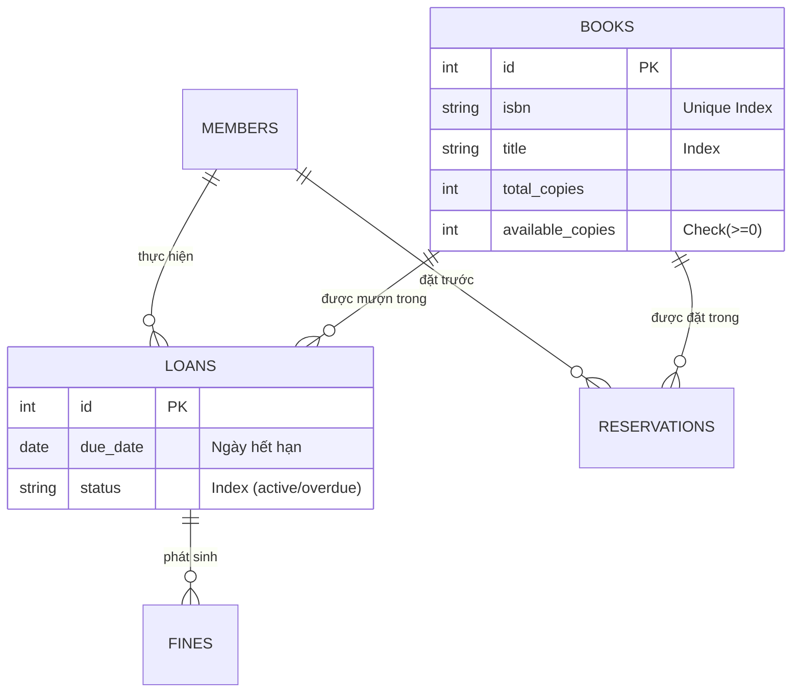

# 📚 Library Manager System

> Hệ thống quản lý thư viện Full-stack hiện đại, tập trung vào tính toàn vẹn dữ liệu (Data Integrity) và hiệu năng cao.


## 📖 Introduction

**Library Manager** là giải pháp phần mềm quản lý thư viện được xây dựng theo kiến trúc Monorepo. Dự án giải quyết các vấn đề nghiệp vụ cốt lõi như quản lý sách, theo dõi mượn trả, tính phí phạt và đặt chỗ trước.

Điểm đặc biệt của hệ thống là khả năng xử lý **Đồng thời** an toàn, ngăn chặn lỗi Race Condition khi nhiều người cùng mượn một cuốn sách cuối cùng, đồng thời tối ưu hóa UX với cơ chế tự động lấy ảnh bìa sách thông minh.

---

## 📂 Project Structure

Cấu trúc thư mục thực tế của dự án:

```text
library-manager/
├── backend/
│   ├── alembic/                # Quản lý Database Migrations
│   ├── app/
│   │   ├── core/               # Config, Constants
│   │   ├── db/                 # Kết nối CSDL (Session, Engine)
│   │   ├── routers/            # API Controllers
│   │   │   ├── analytics.py    # Thống kê báo cáo
│   │   │   ├── books.py        # CRUD Sách
│   │   │   ├── loans.py        # Nghiệp vụ Mượn/Trả
│   │   │   ├── members.py      # Quản lý thành viên
│   │   │   └── reservations.py # Đặt trước sách
│   │   ├── index.py            # Tập hợp Router
│   │   ├── main.py             # Entry point của FastAPI
│   │   ├── models.py           # SQLAlchemy ORM Models
│   │   └── schemas.py          # Pydantic Schemas (Request/Response)
│   ├── tests/                  # Integration Tests
│   ├── poetry.lock             # Dependency lock file (Poetry)
│   ├── pyproject.toml          # Project metadata & dependencies
│   ├── pytest.ini              # Cấu hình Test runner
│   └── alembic.ini             # Cấu hình Alembic
├── frontend/
│   ├── public/                 # Static assets
│   ├── src/
│   │   ├── assets/             # Hình ảnh, SVG resource
│   │   ├── components/         # Các UI Component tái sử dụng
│   │   ├── layout/             # Bố cục trang (DashboardLayout)
│   │   ├── pages/              # Các màn hình chính (Books, Loans, Members...)
│   │   ├── services/           # Cấu hình Axios & API calls
│   │   ├── App.jsx             # Main React Component & Routing
│   │   └── main.jsx            # React Entry point
│   ├── .eslintrc.cjs           # Cấu hình Linting
│   ├── vite.config.js          # Cấu hình Build tool Vite
│   └── package.json            # Dependencies Node.js
├── docker-compose.yml          # Cấu hình Docker (nếu chạy container)
├── vercel.json                 # Cấu hình Deploy Vercel
└── README.md                   # Tài liệu dự án

```

---

## 🛠 Tech Stack

### Backend

* **Core:** Python 3.10+, FastAPI.
* **Database Toolkit:** SQLAlchemy (ORM), Alembic (Migrations).
* **Package Manager:** Poetry (quản lý dependency chuyên nghiệp).
* **Testing:** Pytest (với cấu hình `conftest.py` chạy SQLite In-Memory).
* **Data Validation:** Pydantic.

### Frontend

* **Core:** React 18, Vite.
* **UI Library:** Ant Design (Enterprise UI System).
* **HTTP Client:** Axios.
* **Linting:** ESLint.

---

## ⚡ Tính năng & Business Rules

### 1. Quản lý Mượn/Trả

* **Quy tắc:** Mỗi thành viên chỉ được mượn tối đa **3 cuốn sách**.
* **Cơ chế khóa (Locking):** Sử dụng `SELECT ... FOR UPDATE` (Pessimistic Locking) trong `loans.py` để đảm bảo khi cuốn sách cuối cùng đang được xử lý cho người A, người B sẽ không thể mượn được.
* **Tính phí phạt:** Tự động tính toán số ngày quá hạn * 5.000 VNĐ/ngày khi trả sách.

### 2. Quản lý Kho sách

* **Tìm kiếm:** Hỗ trợ tìm theo Tên, Tác giả, ISBN (có Indexing DB).
* **Ảnh bìa tự động (Smart Cover):** Hệ thống không lưu file ảnh. Frontend tự động hiển thị ảnh bìa theo chiến lược thác nước:
1. API OpenLibrary (Ưu tiên).
2. API Google Books (Dự phòng).
3. Placeholder (Nếu không tìm thấy).


### 3. Đặt trước

* Cho phép thành viên đặt trước sách khi hết hàng.
* Hệ thống chặn xóa sách nếu sách đó đang có người mượn hoặc đang có đơn đặt trước (`books.py` delete logic).

### 4. Báo cáo

* Dashboard hiển thị Real-time: Tổng sách, Thành viên, Đang mượn, Quá hạn.
* Danh sách Top sách được mượn nhiều nhất.

---

## 🗄️ Data Schema

Mô hình dữ liệu quan hệ (ERD) được thiết kế chuẩn hóa:



---

## ⚙️ Configuration

### 1. Backend Setup

Dự án sử dụng **Poetry** (hoặc pip truyền thống).

```bash
cd backend

# Cách 1: Dùng Poetry (Khuyên dùng)
poetry install
poetry shell

# Cách 2: Dùng Pip
# python -m venv venv
# source venv/bin/activate (hoặc .\venv\Scripts\activate trên Windows)
# pip install -r requirements.txt

# Khởi tạo Database (Chạy Migration)
alembic upgrade head

# Chạy Server
uvicorn app.main:app --reload

```

*Server chạy tại: `http://127.0.0.1:8000*`

### 2. Frontend Setup

```bash
cd frontend

# Tạo file môi trường
# (Tạo file .env ngang hàng package.json)
echo "VITE_API_URL=[http://127.0.0.1:8000](http://127.0.0.1:8000)" > .env

# Cài đặt thư viện
npm install

# Chạy Client
npm run dev

```

*Client chạy tại: `http://localhost:5173*`

---

## 🧪 Testing

Hệ thống được thiết lập sẵn môi trường Test biệt lập (Isolation) sử dụng SQLite In-Memory, không ảnh hưởng đến Database chính.

```bash
cd backend
pytest

```

---

## 🚀 API Endpoints Chính

| Method | Endpoint | Chức năng |
| --- | --- | --- |
| `GET` | `/books/` | Danh sách sách (Search & Pagination) |
| `POST` | `/books/` | Thêm sách mới |
| `POST` | `/loans/borrow` | Mượn sách (Có check Transaction) |
| `POST` | `/loans/return/{id}` | Trả sách & Tính phạt |
| `GET` | `/analytics/dashboard` | Số liệu thống kê tổng quan |
| `GET` | `/analytics/overdue-list` | Danh sách phiếu mượn quá hạn |

---

**Project Owner:** [Tên của bạn]

```

```
